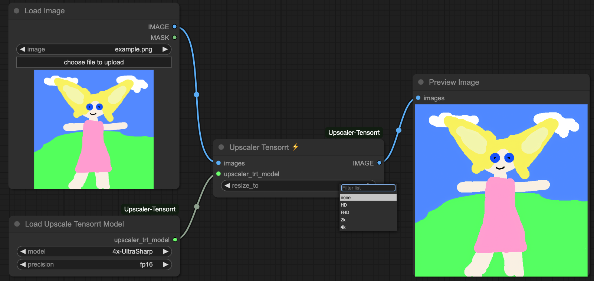

<div align="center">

# ComfyUI Upscaler TensorRT ⚡

[](https://www.python.org/downloads/release/python-31012/)
[](https://developer.nvidia.com/cuda-downloads)
[](https://developer.nvidia.com/tensorrt)
[](https://creativecommons.org/licenses/by-nc-sa/4.0/deed.en)

</div>

This project provides a [Tensorrt](https://github.com/NVIDIA/TensorRT) implementation for fast image upscaling using models inside ComfyUI (2-4x faster)

<p align="center">
  
</p>

## ⭐ Support
If you like my projects and wish to see updates and new features, please consider supporting me. It helps a lot! 

[](https://github.com/yuvraj108c/ComfyUI-Depth-Anything-Tensorrt)
[](https://github.com/yuvraj108c/ComfyUI-Upscaler-Tensorrt)
[](https://github.com/yuvraj108c/ComfyUI-Dwpose-Tensorrt)
[](https://github.com/yuvraj108c/ComfyUI-Rife-Tensorrt)

[](https://github.com/yuvraj108c/ComfyUI-Whisper)
[](https://github.com/yuvraj108c/ComfyUI_InvSR)
[](https://github.com/yuvraj108c/ComfyUI-Thera)
[](https://github.com/yuvraj108c/ComfyUI-Video-Depth-Anything)
[](https://github.com/yuvraj108c/ComfyUI-PiperTTS)

[](https://www.buymeacoffee.com/yuvraj108cZ)
[](https://paypal.me/yuvraj108c)
---

## ⏱️ Performance

_Note: The following results were benchmarked on FP16 engines inside ComfyUI, using 100 identical frames_

| Device |     Model     | Input Resolution (WxH) | Output Resolution (WxH) | FPS |
| :----: | :-----------: | :--------------------: | :---------------------: | :-: |
|  RTX5090  | 4x-UltraSharp |       512 x 512        |       2048 x 2048       |  12.7  |
|  RTX5090  | 4x-UltraSharp |       1280 x 1280      |       5120 x 5120       |  2.0  |
|  RTX4090  | 4x-UltraSharp |       512 x 512        |       2048 x 2048       |  6.7  |
|  RTX4090  | 4x-UltraSharp |       1280 x 1280      |       5120 x 5120       |  1.1  |
|  RTX3060  | 4x-UltraSharp |       512 x 512        |       2048 x 2048       |  2.2  |
|  RTX3060  | 4x-UltraSharp |       1280 x 1280      |       5120 x 5120       |  0.35  |

## 🚀 Installation
- Install via the manager
- Or, navigate to the `/ComfyUI/custom_nodes` directory

```bash
git clone https://github.com/yuvraj108c/ComfyUI-Upscaler-Tensorrt.git
cd ./ComfyUI-Upscaler-Tensorrt
pip install -r requirements.txt
```

## 🛠️ Supported Models

- These upscaler models have been tested to work with Tensorrt. Onnx are available [here](https://huggingface.co/yuvraj108c/ComfyUI-Upscaler-Onnx/tree/main)
- The exported tensorrt models support dynamic image resolutions from 256x256 to 1280x1280 px (e.g 960x540, 512x512, 1280x720 etc).

   - [4x-AnimeSharp](https://openmodeldb.info/models/4x-AnimeSharp)
   - [4x-UltraSharp](https://openmodeldb.info/models/4x-UltraSharp)
   - [4x-WTP-UDS-Esrgan](https://openmodeldb.info/models/4x-WTP-UDS-Esrgan)
   - [4x_NMKD-Siax_200k](https://openmodeldb.info/models/4x-NMKD-Siax-CX)
   - [4x_RealisticRescaler_100000_G](https://openmodeldb.info/models/4x-RealisticRescaler)
   - [4x_foolhardy_Remacri](https://openmodeldb.info/models/4x-Remacri)
   - [RealESRGAN_x4](https://openmodeldb.info/models/4x-realesrgan-x4plus)
   - [4xNomos2_otf_esrgan](https://openmodeldb.info/models/4x-Nomos2-otf-esrgan)
   - [4x-ClearRealityV1](https://openmodeldb.info/models/4x-ClearRealityV1)
   - [4x_UniversalUpscalerV2-Neutral_115000_swaG](https://openmodeldb.info/models/4x-UniversalUpscalerV2-Neutral)
   - [4x-UltraSharpV2_Lite](https://huggingface.co/Kim2091/UltraSharpV2) 
   - [4x-UltraSharpV2](https://huggingface.co/Kim2091/UltraSharpV2) (⚠️ Need more than 24GB VRAM, Not working currently)

## ☀️ Usage

- Load [example workflow](assets/tensorrt_upscaling_workflow.json) 
- Choose the appropriate model from the dropdown
- The tensorrt engine will be built automatically
- Load an image of resolution between 256-1280px
- Set `resize_to` to resize the upscaled images to fixed resolutions

## 🔧 Custom Models
- To export other ESRGAN models, you'll have to build the onnx model first, using [export_onnx.py](scripts/export_onnx.py) 
- Place the onnx model in `/ComfyUI/models/onnx/YOUR_MODEL.onnx`
- Then, add your model to this list [load_upscaler_config.json](load_upscaler_config.json)
- Finally, run the same workflow and choose your model
- If you've tested another working tensorrt model, let me know to add it officially to this node

## 🚨 Updates
### 27 Auguest 2025
- Support 4x-UltraSharpV2_Lite, 4x-UltraSharpV2, 4x_UniversalUpscalerV2-Neutral_115000_swaG, 4x-ClearRealityV1
- Load models from config [PR#57](https://github.com/yuvraj108c/ComfyUI-Upscaler-Tensorrt/pull/57)

### 30 April 2025
- Merge https://github.com/yuvraj108c/ComfyUI-Upscaler-Tensorrt/pull/48 by @BiiirdPrograms to fix soft-lock by raising an error when input image dimensions unsupported
### 4 March 2025 (breaking)
- Automatic tensorrt engines are built from the workflow itself, to simplify the process for non-technical people
- Separate model loading and tensorrt processing into different nodes
- Optimise post processing
- Update onnx export script

## ⚠️ Known issues

- If you upgrade tensorrt version, you'll have to rebuild the engines
- Only models with ESRGAN architecture are currently working
- High ram usage when exporting `.pth` to `.onnx`

## 🤖 Environment tested

- Ubuntu 22.04 LTS, Cuda 12.4, Tensorrt 10.8, Python 3.10, H100 GPU
- Windows 11

## 👏 Credits

- [NVIDIA/Stable-Diffusion-WebUI-TensorRT](https://github.com/NVIDIA/Stable-Diffusion-WebUI-TensorRT)
- [comfyanonymous/ComfyUI](https://github.com/comfyanonymous/ComfyUI)

## License

[Creative Commons Attribution-NonCommercial-ShareAlike 4.0 International (CC BY-NC-SA 4.0)](https://creativecommons.org/licenses/by-nc-sa/4.0/)
